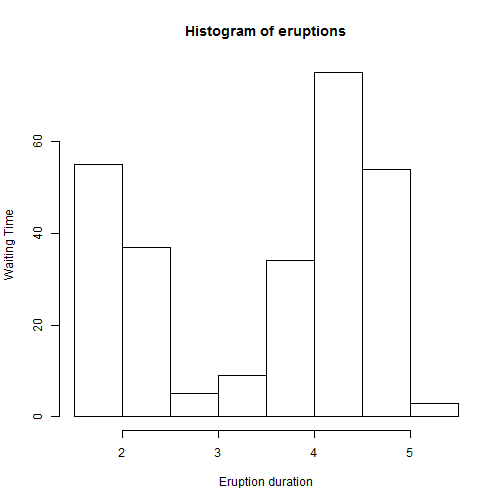
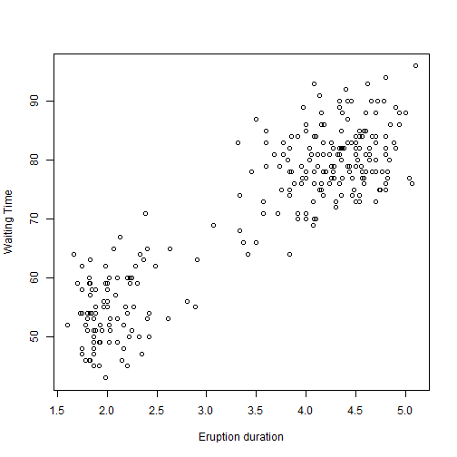

## About the project
This is my slidify project done as part of Develop Data Project Course.
In this presentation we could see that using slidify we can produce presentation directly by executing R Code (embedded code chunks).

Using slidify we can create presentation using HTML5.
Slidify presenations are just HTML files.

## Predicting Geysers
# OLD FAITHFUL GEYSER

Old Faithful is a cone geyser located in Wyoming, in Yellowstone National Park in the United States. Old Faithful was named in 1870 during the Washburn-Langford-Doane Expedition and was the first geyser in the park to receive a name. 

It is one of the most predictable geographical features on Earth, erupting almost every 63 minutes. The geyser, as well as the nearby Old Faithful Inn, is part of the Old Faithful Historic District. 

Location Upper Geyser Basin, Yellowstone National Park, Teton County, Wyoming Coordinates 44.460479N -110.8281591 [1]Elevation 7,349 feet (2,240 m) [2] Type Cone geyser Eruption height 106 feet (32 m) to 185 feet (56 m) Frequency 45 to 125 minutes Duration 1.5 to 5 minutes Discharge 3,700 US gallons (14 m3) to 8,400 US gallons (32 m3) 

--- .class #id 

## Loading Dataset

Faithful data set (available as part of R) is about waiting time between eruptions and the duration of the eruption for the Old Faithful geyser in Yellowstone National Park, Wyoming, USA. This has a data frame with 272 observations on 2 variables. First field is eruptions (in mins), Second field is waiting time (in mins)


```r
#attach(faithful)
summary(faithful)
```

```
##    eruptions        waiting    
##  Min.   :1.600   Min.   :43.0  
##  1st Qu.:2.163   1st Qu.:58.0  
##  Median :4.000   Median :76.0  
##  Mean   :3.488   Mean   :70.9  
##  3rd Qu.:4.454   3rd Qu.:82.0  
##  Max.   :5.100   Max.   :96.0
```

--- .class #id 

## Creating Eruption Histogram

Using faithful data set we will be creating a histogram using R code. 

```r
#attach(faithful)
hist(eruptions, xlab="Eruption duration", ylab="Waiting Time")
```

 

```r
plot(eruptions, waiting, xlab="Eruption duration", ylab="Waiting Time")     
```

 

--- .class #id 

## Creating Eruption Histogram

Using faithful data set we will be creating a histogram using R code. 

```r
plot(eruptions, waiting, xlab="Eruption duration", ylab="Waiting Time")     
```

 

## Thank You ! :)
